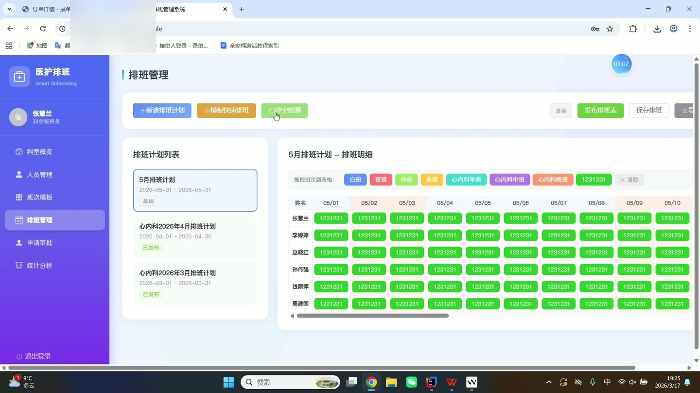
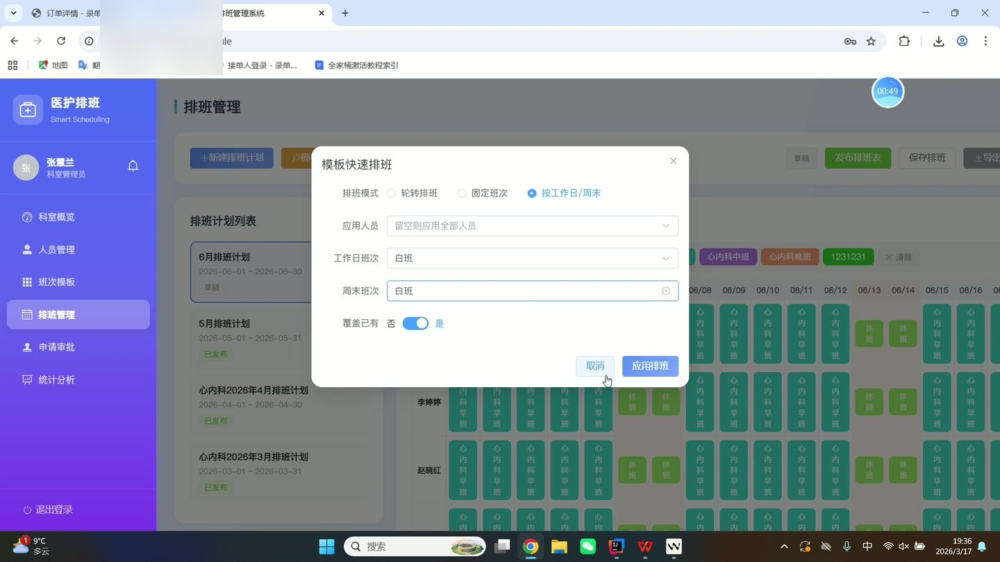
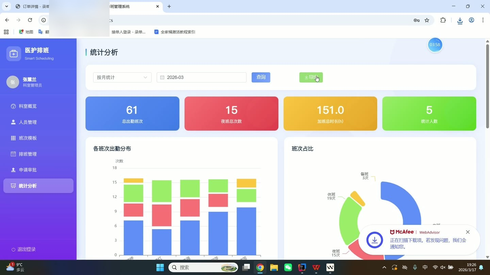
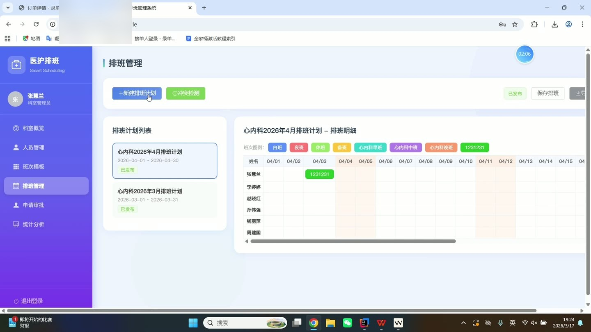
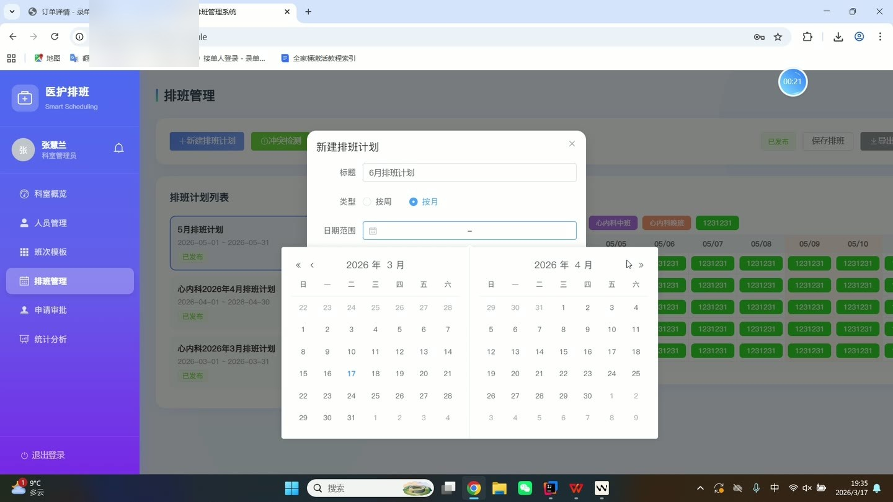

# (附文档)Springboot3+Vue3+MySQL 医护人员排班系统

**技术栈**：Springboot3、Vue3、MySQL

### 系统简介

本系统是一套基于 Spring Boot 3 + Vue 3 + MySQL 的医护人员排班管理系统，采用前后端分离架构。系统支持三种角色：普通医护人员（STAFF）、科室管理员（DEPT_ADMIN）和系统管理员（ADMIN）。医护人员可查看个人排班、提交调班换班及休假申请；科室管理员负责排班计划制定、班次模板配置、申请审批及统计分析；系统管理员管理科室、角色权限及系统配置。
 
### 核心功能
 
### 普通用户端

- 查看个人排班日历，按起止日期筛选已发布的排班详情（含班次名称、颜色标识）

- 提交调班换班申请，填写原日期、目标日期、原班次、目标班次、协作人及原因

- 查看本人发起的调班换班申请列表，追踪审批状态（PENDING/APPROVED/REJECTED）

- 提交休假申请，选择休假类型（病假/事假/年假等）、起止日期并填写理由

- 查看本人提交的休假申请列表，查看审批意见及审批人

- 对已发布的排班计划提交反馈意见，关联具体排班计划

- 查看本人的排班反馈历史及管理员的回复内容

- 查看个人通知列表，支持标记单条通知为已读或一键全部已读

- 查看未读通知数量，在导航栏实时显示未读角标

- 编辑个人资料，包括修改姓名、手机号、邮箱、头像、职称、夜班资格、特殊要求等

- 修改个人登录密码

- 查看个人排班统计，按日期范围统计各班次出勤次数
 
### 管理员端

- 查看系统总览仪表盘，显示总用户数、科室数、医护人员数、待审批调班/休假/反馈数量

- 管理科室信息：新增、编辑、删除科室（名称、院区、描述）

- 管理用户账号：新增医护人员账号（默认密码 123456）、编辑信息、禁用/启用账号、删除账号

- 按科室筛选用户列表，查看用户详情（含所属科室名称）

- 配置班次模板：新增、编辑、删除班次（名称、开始/结束时间、时长、颜色标识、适用科室）

- 按科室筛选可用的班次模板列表

- 创建排班计划：选择科室、填写计划标题、起止日期、计划类型，自动生成草稿状态

- 编辑排班计划详情：为每位医护人员按日期分配班次模板，支持批量保存

- 发布排班计划：将草稿计划发布为已发布状态，发布后自动向该科室全体医护人员发送通知

- 查看排班计划列表（含科室名称、创建人、状态），支持按科室筛选

- 导出排班计划为 Excel 文件，包含所有医护人员的每日班次安排

- 审批调班换班申请：查看本部门所有待审批申请，通过或驳回并填写审批意见

- 审批休假申请：查看本部门所有待审批申请，通过或驳回并填写审批意见

- 查看本部门排班反馈列表，对每条反馈进行回复

- 查看排班统计报表：按计划统计每位医护人员的各班次出勤次数

- 查看科室考勤报表：按日期范围统计部门内医护人员的每日班次、星期分布

- 查看科室仪表盘：显示本科室医护人员数、待审批调班/休假/反馈数量
 
### 系统管理员端

- 管理系统基础配置项：新增、编辑系统参数（键、值、描述）

- 查看系统运行监控数据

- 查看系统总览仪表盘，包含全局统计数据
 
### 技术栈

后端框架
Spring Boot 3.x

ORM
MyBatis-Plus（含分页插件）

权限认证
JWT（Token 鉴权） + 自定义拦截器

密码加密
BCryptPasswordEncoder

前端框架
Vue 3（Composition API + script setup）

路由
Vue Router 4（按角色路由守卫）

构建工具
Vite

数据库
MySQL（含 7 张业务表：sys_user, department, shift_template, schedule_plan, schedule_detail, shift_change_request, leave_request, schedule_feedback, notification, sys_config）

Excel 导出
Apache POI（XSSFWorkbook）

文件上传
MultipartFile + 本地存储

 
### 交付内容

- 后端完整源码

- 前端完整源码

- 数据库初始化脚本

- 万字文档

## 界面展示

---

## 获取完整源码 + 万字文档

本仓库为项目介绍页。**完整前后端源码、数据库初始化脚本、万字项目文档**，请加微信 `kangkangcode`，或访问 [codekk.top](http://codekk.top) 获取。

可作课程设计 / 毕业设计参考，支持远程部署调试。